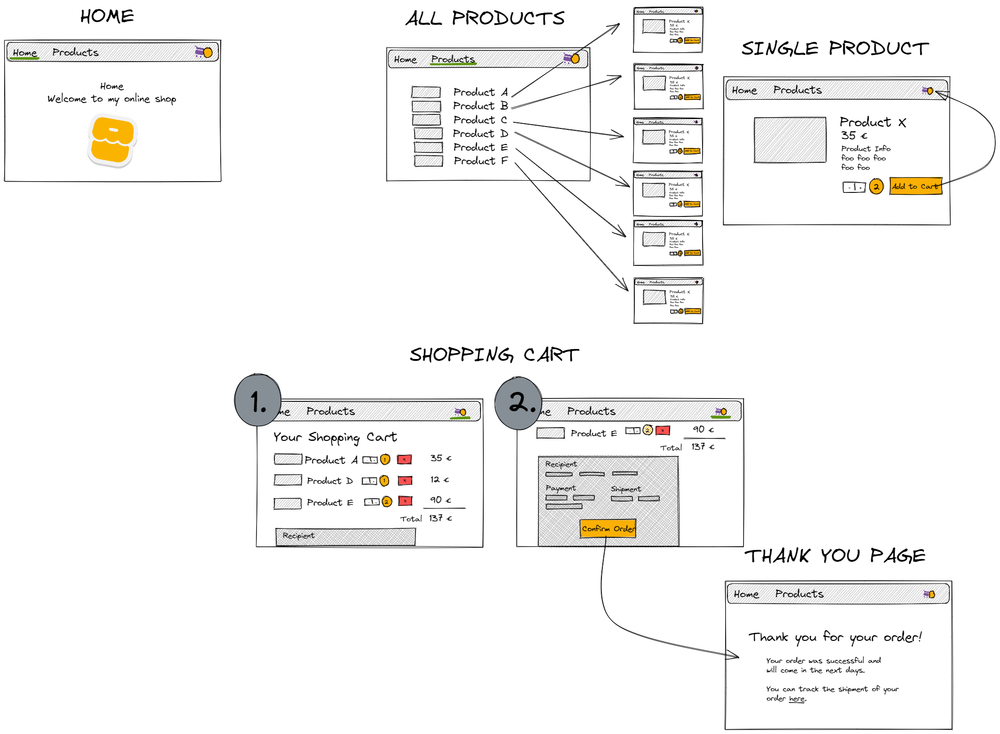
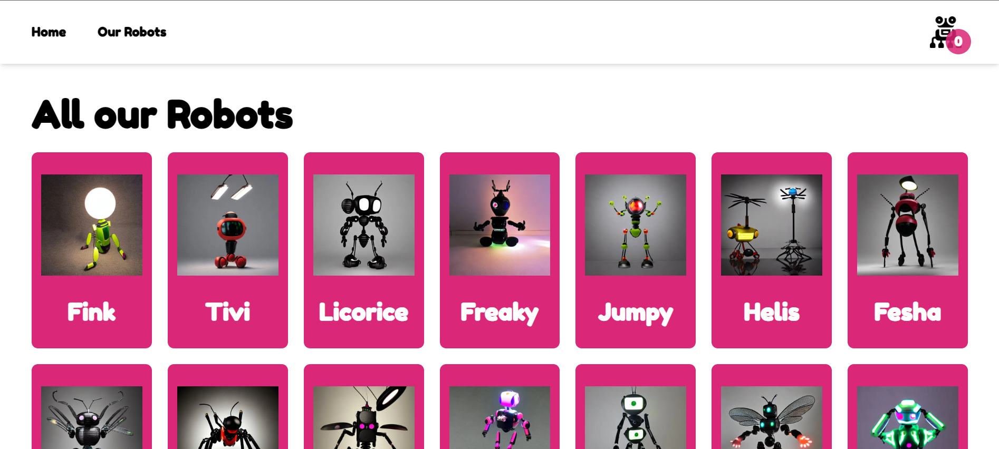
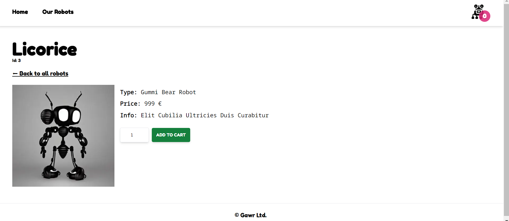

# Robot Shop

This is my first Next.js project to practice building a fullstack application.

In the shop, you can 'buy' robots, that are completely generated by an AI: https://huggingface.co/spaces/stabilityai/stable-diffusion.

## Planning the website

A sketch, made with Excalidraw, to help me envision my project.

It has a homepage greeting the customers. In the header is a header with a shopping cart icon on the right side, that includes the number of products, that have been added to the cart, and a footer describing the 'company'.

### Description: Walkthrough

### From Homepage to Our robots

When you navigate to 'Our robots' in the header, you see a grid, including all the available robots and their names (coming from a postgres database). On clicking on a robot, you will be directed to the page of the chosen robot (a dynamic route, defined as the id from the database).

### Single Robot (dynamic route)

Here you can see a description, the price, the id and the name of the robot. When clicking on the +/- button, the quantity in the field between the buttons changes (only positive values). The number of robots will only be added to your shopping cart, when you click on the 'Add to cart' button next to the +/- buttons.

When you click on 'Back to all robots', you can choose another robot on the 'Our robots' page. The scrolling position on the 'Our robots' page will be the same as when you left it to go to a single robot.

When you choose more robots, they will be added to the existing cart. When you are done, you can click on the 'Shopping cart' in the top right corner with the quantity of chosen robots to see your robots and to check out.

#### Putting in a non-existent ID in the URL

If you put an id into the route, that does not exist in the database, an error page will be shown. From here you can go back to the 'Our robots' page.

### Shopping cart and Checkout

Here you can change the quantity again (but without 'Add to cart' - the amount will change immediately but can also be changed back) and remove a robot from the cart completely. When you click on 'Checkout', you are redirected to the checkout page, where you can see your order overview. You will also need to put in your shipping address and payment info to activate the 'Checkout' button on the bottom of the form.

When clicking the checkout button, you are redirected to a thank you page and all items will be deleted from your cart.

## Technologies

- Javascript, JSX, JSON
- Tailwind CSS
- Next.js/React
- Cookies
- PostgreSQL, psql
- node.js
- ley
- Playwright, Jest
- Git, Github
- Fly, flyctl
- Prettier
- ESLint
- Docker
- yarn
- Excalidraw

## Setup Instructions

To set up the project on a new computer, the ley package is needed for the migration of the Postgres database. It stores the robots, sold at the ecommerce store, including their name, type, price and info (aka description).

Run "yarn migrate up" (or a different package manager) to load the migration files stored in the folder 'migrations'.

## Deployment Instructions

The project is deployed on Fly.io.

0. Set up Github Actions in my project for the deployment.
1. Sign in/up: When deploying, I need to be logged in to an account at Fly.io. It only worked in my case, when I signed up with a new account instead of signing up with my Github account.
2. Create a token for Github called "Github Actions Deploy Token", copy it and save it as "FLY_API_TOKEN" to my Github repo secrets. This way, my Github repo is connected to the deployed website and will be updated every time I change my repo.
3. Use the Fly command line client 'flyctl' to authenticate the account with 'flyctl auth login' and confirm it in the browser window, that will have opened up. Then I go back to the command line.
4. Now I create an app and name it with this command "flyctl apps create --name next-ecommerce-store-robots". This name will be the beginning of my URL: "next-ecommerce-store-robots.fly.dev".
5. The config files need to be set up: "fly.toml", "Dockerfile" and ".dockerignore" in the root and "fly.yaml" in ".github/workflows".
6. The database storing the robots also needs to be connected: I need to add something to the beginning of my "connect.ts" file: "if (process.env.NODE_ENV !== 'production') config();" so the config() function from "dotenv-safe" only runs when in development but not when in production.
7. Add the database credentials to the Fly.io secrets with this command: "flyctl secrets set PGHOST=localhost PGDATABASE=$(openssl rand -hex 16) PGUSERNAME=upleveled$(openssl rand -hex 16) PGPASSWORD=$(openssl rand -base64 32)", creating random credentials.
8. Create a 1GB PostgreSQL database in the Frankfurt region with this command: "flyctl volumes create postgres --size 1 --region fra"
9. Deploy for the first time: "flyctl deploy".
10. If problems appear,
    a. check if packages need to be moved to the dependencies instead of the devDependencies (e.g. Tailwind, typescript, @types).
    b. check the monitoring in the fly.io dashboard for errors.
