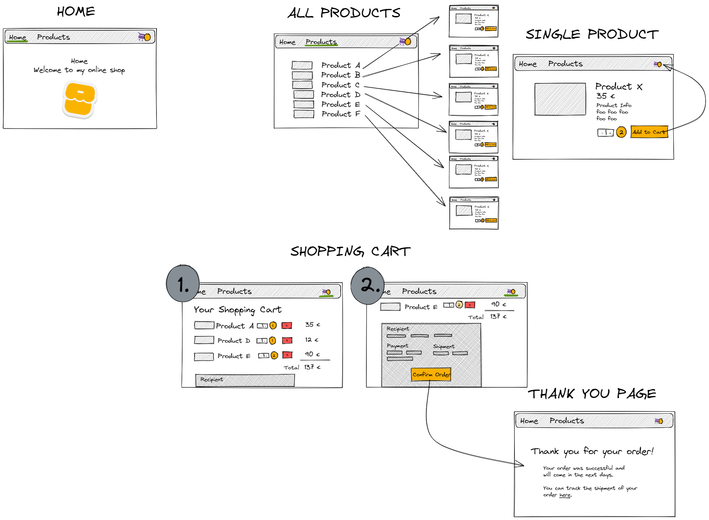

# Robot Shop

This is my first Next.js project to practice building a fullstack application.

In the shop, you can 'buy' robots, that are completely generated by an AI: https://huggingface.co/spaces/stabilityai/stable-diffusion.

## Planning the website

A sketch, made with Excalidraw, to help me envision my project.

It has a homepage greeting the customers. In the header is a nav bar with a shopping cart icon on the right side, that includes the number of products, that have been added to the cart, and a footer describing the 'company'.

### Description: Walkthrough

### From Homepage to Our robots

When you navigate to 'Our robots' in the header, you see a grid, including all the available robots and their names (coming from a postgres database). On clicking on a robot, you will be directed to the page of the chosen robot (a dynamic route, defined as the id from the database).

### Single Robot (dynamic route)

Here you can see a description, the price, the id and the name of the robot. When clicking on the +/- button, the quantity in the field between the buttons changes (only positive values). The number of robots will only be added to your shopping cart, when you click on the 'Add to cart' button next to the +/- buttons.

When you click on 'Back to all robots', you can choose another robot on the 'Our robots' page. The scrolling position on the 'Our robots' page will be the same as when you left it to go to a single robot.

When you choose more robots, they will be added to the existing cart. When you are done, you can click on the 'Shopping cart' in the top right corner with the quantity of chosen robots to see your robots and to check out.

#### Putting in a non-existant number in the route

If you put an id into the route, that does not exist in the database, an error page will be shown. From here you can go back to the 'Our robots' page.

### Shopping cart and Checkout

Here you can change the quantity again (but without 'Add to cart' - the amount will change immediately but can also be changed back) and remove a robot from the cart completely. When you click on 'Checkout', you are redirected to the checkout page, where you can see your order overview. You will also need to put in your shipping address and payment info to activate the 'Checkout' button on the bottom of the form.

When clicking the checkout button, you are redirected to a thank you page and all items will be deleted from your cart.

## Technologies

- Javascript, JSX, JSON
- Tailwind CSS
- Next.js/React
- Cookies
- PostgreSQL, psql
- node.js
- ley
- Playwright, Jest
- Git, Github
- Fly, flyctl
- Prettier
- ESLint
- Docker
- yarn
- Excalidraw
